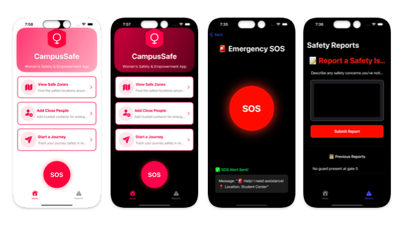
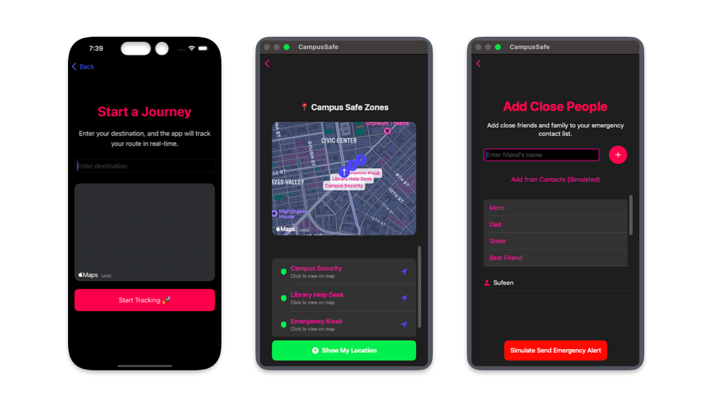
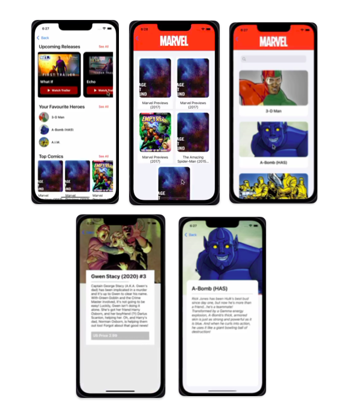
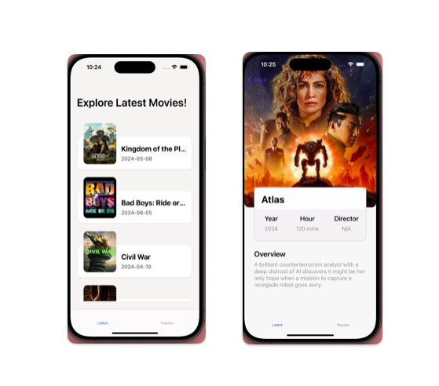
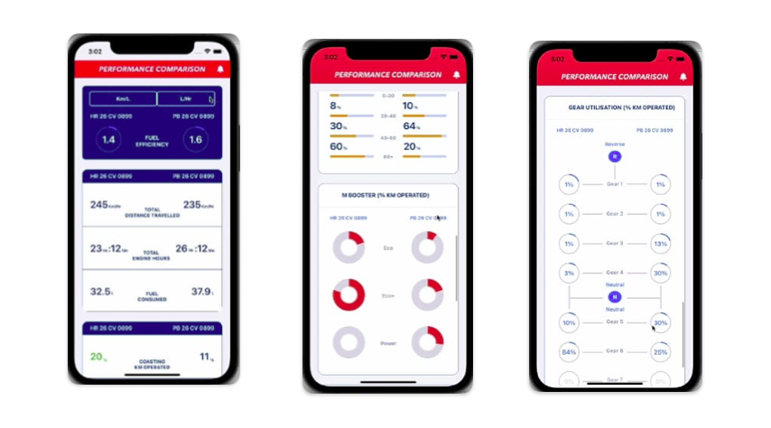
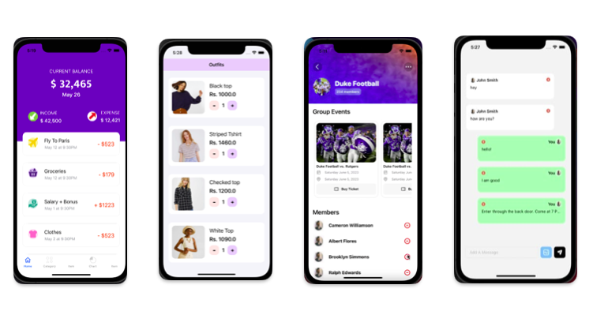

<h1 align="center">Hi there 👋, I'm Sufeen Shaikh</h1>

  <em>A passionate iOS Developer crafting real-world Swift apps with purpose, performance, and polish.</em>

---

### 🚀 Featured Projects

#### 📍 CampusSafe – Safety Companion App  
Empowering students with real-time safety tools like SOS alerts, journey tracking, and zone-based alerts.  
**Tech:** Swift,SwiftUI  

---

#### 🦸‍♂️ Marvel Explorer – Comic Universe in Your Pocket  
Explore Marvel characters, top comics, and upcoming releases with beautiful card layouts.  
**Tech:** UIKit, Marvel API  

---

#### 🎬 Movie Info App – Discover What’s Trending  
Stay updated with the latest movies, release dates, and summaries.  
**Tech:** SwiftUI, TMDB API, AsyncImage  

---

### 🛠️ Internship & Live Projects

#### 📊 Eicher Performance App (Live Project – Internship)
Contributed to a commercial-grade telematics app for vehicle performance monitoring.  
- Built **complex UI structures** in UIKit with modular Swift components  
- Integrated third-party libraries using **CocoaPods**  
- Delivered a scalable layout that supports multiple data visualizations  
- 🚀 **5M+ downloads** on the Play Store  

---

#### 💼 Additional Live UI Snippets
Snippets from various real-world projects crafted during my internship and freelance work.  
Focus on **clean UI**, **Swift best practices**, and **component-based UIKit development**.  

---

### 💻 About Me
- 🎓 Currently pursuing MCA  
- 💡 Loves building apps that solve real problems  
- 🧠 Always learning and contributing to open source  
- ✨ Passionate about creating accessible and safe digital experiences  

---

### 🧰 iOS Development Skills

- **UI/UX:** Built custom interfaces using **UIKit** & **SwiftUI** – scroll views, tab bars, side menus, dropdowns, and bottom sheets.
- **Architecture:** Applied **delegate pattern**, **MVVM**, and modular design for scalable and maintainable code.
- **Data & Networking:** Integrated **REST APIs**, handled **JSON decoding**, and used **Core Data** for persistent local storage.
- **Media & Maps:** Implemented native video playback with **AVKit**, and added location features via **MapKit**.
- **Authentication & Forms:** Built secure login, validation logic, and user session flows.
- **Reusable Components:** Developed UI elements like **tag list views**, **radio buttons**, **alerts**, and custom dropdowns.
- **Testing & Tooling:** Wrote **unit tests**, used **CocoaPods**, version-controlled projects with **Git & GitHub**.
- **Web & Views:** Integrated **WKWebView**, activity views, and image compositing utilities.

Hands on experience with **protocols**, **closures**, **extensions**, **Firebase**, **Google Sign-In**, **push notifications**, **Core Animation**, **parallax effects**, **Alamofire**, and modern UX feedback with **activity indicators**.

### 📫 Let's Connect
Feel free to explore my projects and reach out via GitHub!

---

### 🛠️ Tech Stack
`Swift` `SwiftUI` `UIKit` `JAVA` `AI-ML` `Firebase` `Git/GitHub` 

---

  Built with ❤️ by Sufeen Shaikh

